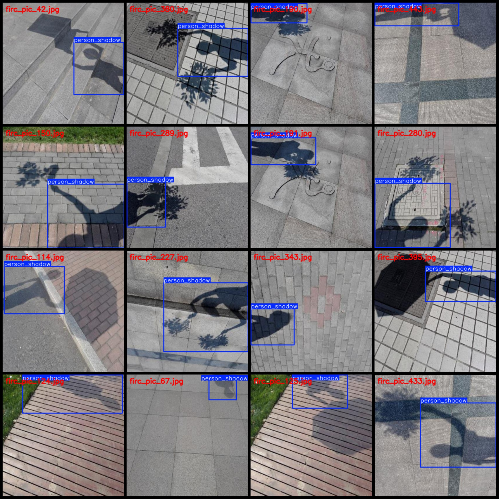
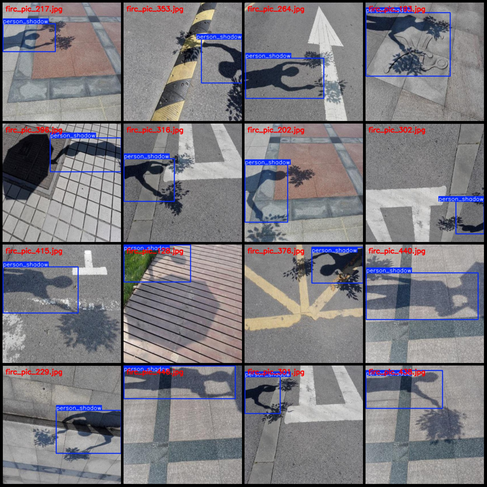

# Sunlight-Under-Person Shadow Detection Dataset - VOC+YOLO Format, 490 Images in 1 Class

**Dataset Format:** Pascal VOC format + YOLO format (txt file without split paths, only containing jpg images and corresponding VOC format xml files and yolo format txt files)

**Image Count (Number of JPG Files):** 490
**Annotation Count (XML Files Count):** 490
**Annotation Count (Txt Files Count):** 490
**Annotation Class Count:** 1
**Annotation Class Name:** ["person_shadow"]
**Box Count for Each Class:**
- person_shadow box count = 490
- Total boxes = 490
**Image Count for Each Class:**
- person_shadow image count = 490
**Image Resolution:** 416x416
**Annotation Tool Used:** labelImg
**Annotation Rules:** Draw bounding boxes for the category
**Important Notice:** The dataset does not have separate training/validation/test sets; please divide them yourself.
**Special Disclaimer:** This dataset does not guarantee the accuracy of the trained models or weight files.
**Image Preview:**
**Annotation Example:**

## Images

Here is a pay link on Stripe ( https://buy.stripe.com/3cs8yP7sY87d0vu9AB ). Please contact me lonlonago@foxmail.com after funding $89, and I will send you a complete data files , thank you!

